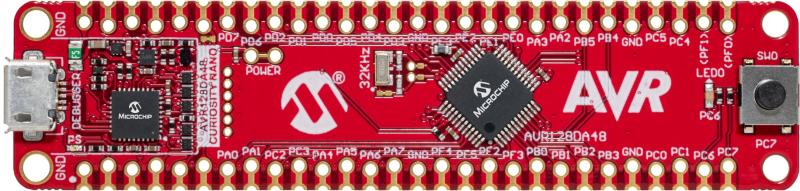

<!-- Please do not change this logo with link -->

<a target="_blank" href="https://www.microchip.com/" id="top-of-page">
   <picture>
      <source media="(prefers-color-scheme: light)" srcset="images/mchp_logo_light.png" width="350">
      <source media="(prefers-color-scheme: dark)" srcset="images/mchp_logo_dark.png" width="350">
      
   </picture>
</a>

# PIR Motion Detection with FreeRTOS™ Using AVR128DA48 Microcontroller with MCC Melody

This MPLAB® X project demonstrates FreeRTOS with two tasks for monitoring and displaying Passive Infrared (PIR) sensor output. The first task, `prvQueueReadADCTask`, starts a conversion for the sensor's analog output voltage using the ADC after a 2-second delay and then enters a Suspended state. It is resumed by an ADC interrupt when motion is detected, that means the output voltage is outside the set window thresholds. Upon resumption, it triggers the second task, `prvQueuePrintMessageTask`, to print a message to the serial terminal, providing system feedback. The project highlights FreeRTOS' multitasking efficiency and real-time capabilities by managing motion detection and serial communication through task suspension and resumption.

 

## Related Documentation

More details and code examples on the AVR128DA48 can be found at the following links:

- [FreeRTOS™](https://www.freertos.org/index.html)
- [FreeRTOS Demo for the Microchip AVR Dx Port](https://www.freertos.org/microchip-avr-dx-demo.html)
- [AVR128DA48 Product Page](https://www.microchip.com/wwwproducts/en/AVR128DA48?utm_source=GitHub&utm_medium=TextLink&utm_campaign=MCU8_AVR-DA&utm_content=avr128da48-freertos-adc-pir-mplab-mcc-github&utm_bu=MCU08)
- [AVR128DA48 Code Examples on GitHub](https://github.com/microchip-pic-avr-examples?q=AVR128DA48)

## Software Used

- [MPLAB X IDE v6.20 or newer](https://www.microchip.com/en-us/tools-resources/develop/mplab-x-ide?utm_source=GitHub&utm_medium=TextLink&utm_campaign=MCU8_AVR-DA&utm_content=avr128da48-freertos-adc-pir-mplab-mcc-github&utm_bu=MCU08)
- [MPLAB® XC8 v2.50 or a newer compiler](https://www.microchip.com/en-us/tools-resources/develop/mplab-xc-compilers?utm_source=GitHub&utm_medium=TextLink&utm_campaign=MCU8_AVR-DA&utm_content=avr128da48-freertos-adc-pir-mplab-mcc-github&utm_bu=MCU08)
- [AVR-Dx v2.6.303 or newer Device Pack](https://packs.download.microchip.com/#collapse-Microchip-AVR-Dx-DFP-pdsc)

## Hardware Used

- The [AVR128DA48 Curiosity Nano Development board (DM164151)](https://www.microchip.com/Developmenttools/ProductDetails/DM164151) is used as test platform:
   

- Curiosity Nano Adapter:
   

- [PIR Click MikroE](https://www.mikroe.com/pir-click?srsltid=AfmBOopYUtTlNvggeqKTCLglWKHqCbVnXYskk-TY1tI2J5-hB3BICJUI) board:
   

## Setup

The following peripheral and clock configurations are set up using the MPLAB® Code Configurator (MCC) Melody for the AVR128DA48:

1. Clock Control:
   - Oscillator Frequency Selection: 24 MHz system clock
      
2. FreeRTOS Library:
   - Select RTOS Interface Timer Selection (TCB0, for example)
   - Set the Tick Rate (Hz): 1000
   - Communication Protocol: UART
   - BaudRate Selector: 115200
      
3. USART1:
   - Enable USART Receiver: Enabled
   - Enable USART Transmitter: Enabled
4. ADC:
   - Clock Prescaler: CLK_PER divided by 256
   - Sample Accumulation Number: 16 results accumulated
   - Sample Length (# of ADC Clock): 2
   - Enable ADC: Enabled
   - Resolution Selection: 12-bit mode
   - Left Adjust Result: Enabled
   - Free Running Mode: Enabled
   - Positive Channel Input Selection: ADC input pin 4
   - Window Comparator Interrupt: Enabled
   - Window Comparator Mode: Outside Window
   - Window Comparator High Threshold(V): 30.4 (Number of Accumulated Samples \* High Threshold Voltage Reference = 16 \* 1.9V = 30.4 V)
   - Window Comparator Low Threshold(V): 0.08 (Number of Accumulated Samples \* Low Threshold Voltage Reference = 16 \* 0.005V = 0.08 V)
      
5. VREF:
   - VDD (V): 3.3
   - ADC Voltage Reference Source: VDD as reference
6. Pin Grid View:
   - USART1 TX: PC0 (CDC TX)
   - USART1 RX: PC1 (CDC RX)
   - ADC0 input: PD4 (AIN4)
      

**NOTE:** The `freertos_interface.c` source file must be manually configured. More details and the explained code can be found in the [interface source file](avr128da48-freertos-adc-pir-mplab-mcc.X/mcc_generated_files/freertos/freertos_interface.c).

## Operation

To program the Curiosity Nano board with this MPLAB X project, follow the steps provided in the [How to Program the Curiosity Nano Board](#how-to-program-the-curiosity-nano-board) chapter.  

## Demo

In the demo section, the GIF below visually demonstrates the real-time monitoring of the PIR sensor's output voltage, which is continuously updated using the ADC. Simultaneously, the serial terminal displays the corresponding messages, confirming the system's operational status. The smooth interaction between tasks highlights the efficiency of FreeRTOS in handling multiple processes concurrently.

 

Also, a screenshot provides a static snapshot of the system in action for quick reference.

 

## Summary

This FreeRTOS project involves two tasks running in parallel: one reads the output voltage of a PIR sensor using the ADC, and the other prints status messages to a serial terminal. The project demonstrates the capability of FreeRTOS in managing real-time tasks, showcasing efficient multitasking, with an 8-bit AVR device. It highlights the seamless interaction between sensor data acquisition and serial communication, making it ideal for embedded system applications.

## How to Program the Curiosity Nano Board

This chapter demonstrates how to use the MPLAB X IDE to program an AVR device with an Example_Project.X. This is applicable to other projects.

1.  Connect the board to the PC.

2.  Open the Example_Project.X project in MPLAB X IDE.

3.  Set the Example_Project.X project as main project.
     Right click the project in the **Projects** tab and click **Set as Main Project**.
     

4.  Clean and build the Example_Project.X project.
     Right click the **Example_Project.X** project and select **Clean and Build**.
     

5.  Select **AVRxxxxx Curiosity Nano** in the Connected Hardware Tool section of the project settings:
     Right click the project and click **Properties**.
     Click the arrow under the Connected Hardware Tool.
     Select **AVRxxxxx Curiosity Nano** (click the **SN**), click **Apply** and then click **OK**:
     

6.  Program the project to the board.
     Right click the project and click **Make and Program Device**.
     

 

---

## Menu

- [Back to Top](#pir-motion-detection-with-freertos-using-avr128da48-microcontroller-with-mcc-melody)
- [Back to Related Documentation](#related-documentation)
- [Back to Software Used](#software-used)
- [Back to Operation](#mcc-configuration)
- [Back to Hardware Used](#hardware-used)
- [Back to Setup](#setup)
- [Back to Demo](#demo)
- [Back to Summary](#summary)
- [Back to How to Program the Curiosity Nano Board](#how-to-program-the-curiosity-nano-board)
